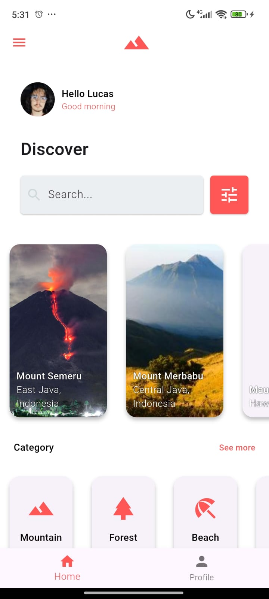

# 🌄 WanderFind

**WanderFind** is a Flutter app that showcases a collection of stunning mountains around the world using horizontally scrollable cards. Each card features an image, name, and location, with a clean, reusable UI structure.

## 📱 Features

- Home screen with transparent AppBar and navigation drawer
- Horizontally scrollable list of mountain cards (`ListView.builder`)
- `AppCard` widget with image, title, and location
- Basic search UI component (non-functional for now)
- Modular folder structure

## 📁 Project Structure

```
lib/
├── data/             # Mock data (e.g., mount_items.dart)
├── model/            # Data models (e.g., MountModel)
├── pages/            # Pages and screens (e.g., HomePage)
├── widgets/          # Reusable widgets (AppCard, AppHeader, etc.)
├── main.dart         # Entry point
```

## 🧱 Tech Stack

- Flutter
- Dart
- Material Design

## 🚀 Getting Started

1. Clone the repository:

   ```bash
   git clone https://github.com/your-username/wanderfind.git
   cd wanderfind
   ```

2. Install dependencies:

   ```bash
   flutter pub get
   ```

3. Run the app:
   ```bash
   flutter run
   ```

## 🔮 Future Improvements

- Implement functional search with filters
- Add detail screen for each mountain
- Integrate backend API for dynamic content
- Add animations for smooth transitions

## 📸 Preview



_AppBar with terrain icon and search input_

---

Made with ❤️ using Flutter — _Explore the heights with WanderFind_
